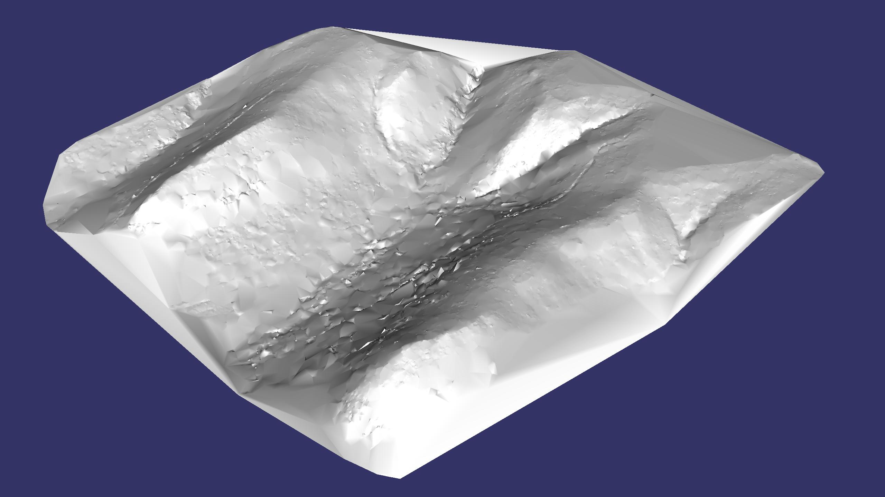

# Image Analysis

Aerial imagery analysis, processing, and presentation scripts.

# Important Notice:

*March 5, 2022*

I love the University of Minnesota, but my funding ran out and we
weren't able to get anything new lined up in time.  So March 18 is my
last day at the University of Minnesota, Dept. of Aerospace
Engineering, UAV lab. :-(

At the same time I'm super excited to be transition to a new position
at Cirrus Aircraft in Duluth.  This will change many things, including
my time available and my focus relative to working on this project.
For a couple years this code was integral to my daily work, and that
probably will no longer be true once I transition to my new position.

My hope is to keep this project going long term, to be available
(within reason) to answer questions, and to guide people getting up to
speed for the first time.  I am sincerly hopeful I can continue to
improve and add features as time permits.

# Screen shots

- A mosaic of 2812 images from a Phantom 4 Pro v2 mission

- A 3d surface rendering of the same area

- A zoom in showing all the original detail and oblique perspective
  from the original imagery because the mapping tool simply draws the
  original images in a big pile all sized, oriented, stretched, and
  aligned perfectly.

# Brief Overview

This image analysis tool-set started as two independent efforts to
build a better (faster, free-er, more robust) image stitching system
for aerial surveying.  The accumulated knowledge of these two projects
were merged to form a single project going forward.  Over time, this
project has evolved into a full blown aerial survey and mapping system
that supports a variety of research projects with specific needs
(use-cases) not well supported by existing commercially tool.  The
ImageAnalysis project improves over most existing systems in several
distinct ways:

- The final orthographic map as presented as a big pile of original
  images; all sized, scaled, rotated, stretched, and fitted to each
  other perfectly.  All the original images, perspectives, and full
  pixel resolution are preserved and can be examind in the context of
  the full map.  For our projects, this is a powerful tool for
  "finding a needle in a haystack" type tasks.

- New robust match finding strategies have been developed that find a
  significantly higher number of image match pairs in traditionally
  challenging environments such as forests or mature crop fields.  We
  regularly out-perform well known commercial packages in terms of
  fitting more of your images together correctly into the final map.

- All the code is licensed with the MIT open-source license and
  written in python to be as open and accessible as possible.  We are
  developing this project in a research lab and wish to be open and
  share the knowledge and tools we develop.

The project goals remain:

- develop a quality open-source image fitting (stitching) and scene
  reconstruction tool chain that is appropriate for examination
  (education) and modification (research use.)

- leverage well known building blocks including python, opencv, numpy,
  and scipy.

- continue to develop and refine offshoot projects that support our
  UAS Lab projects: such as EKF validation, augmented reality,
  movie/flight-data time correlation.

- develop extensions and improvements in support of ongoing research
  project.  (Such as: invasive species surveys, mapping, and ground
  truthing.)

# Current and Recent Development Focus

This is likely to be out of date faster than I can write it, but here
are a few things I have been working recently.

- Improving and streamlining the project structure layout.  Now an
  "ImageAnalysis" folder is added to each folder of raw images.

- Improving the project setup flow and autodetecting camera/lens
  config and image geotags when possible.

- Streamlining support for DJI and Sentera camera systems.

- Continuing visual presentation improvements

- Signficant improvements finding matches in challenging areas (that
  break many commercial tools), areas such as forests and mature crop
  fields when imaged from a low altitude.

- Continuing work on image connection grouping optimizations to
  improve solver (optimizer) results and reduce artifacts.

- [done] Renable/retool code to best fit optimized solution to original
  camera pose locations.  (This ensures the solution didn't walk off
  in some random direction, and also that the final fit is as close to
  the real world location as we are able to do with the given data
  set.)

- [done] Continued improvement of python3 support

- [done] A scene exploration tool that knows all the views covering
  any point, can geolocate any selected point in an image, can
  import/export kml/csv for sharing results or to export to other
  mapping tools.

# Future Road Map

Briefly, near term development goals include:

- Continue work on real-time shader language techniques to highlight
  different types of (color) features in the imagery.

Medium term development goals include:

- Continued exploration of machine vision strategies for automatically
  identifying/locating items of interest in imagery.  (Such as:
  oriental bittersweet.)

Wish list items:

- The current code optimizes the 'sparse' mesh, but does not do dense
  mesh reconstruction.  It would be interesting to explore dense mesh
  generation for creating detailed DEM's and exact orthophotos.  This
  is a core strength of commercial image stitching tools, but perhaps
  not necessary for every aerial survey application.

  The most important objective is to answer questions like "Where is
  all the oriental bittersweet in the survey area?"  A pretty picture,
  an orthorphoto, or a DEM may not always be the best tool to help
  answer that question, while other customized approaches may do
  better.

- I would love to see a community of interested tinkerers grow up
  around this project.  I think there are many important concepts and
  strategies here that have far ranging uses and implications.  It
  would be great to keep a light shining on this area so the expertise
  doesn't get entirely buried inside the caves of the commercial
  world.

# Code Layout

## 3rd_party

   Home to 3rd party code that needs modifications or adjustments to
   be helpful.  (Or things that aren't commonly available
   system-wide.)

## scripts

   A series of front-end scripts that primarily pair with the lib
   directory for feature detection, matching, and scene assembly.  For
   making maps the process is actually quite simple:

   - run "process.py /path/to/images" This will process all the images
     and create the map.
     
   - run "explorer.py /path/to/images" This will launch the
     interactive explorer tool to view your map.
   
## scripts/lib

   Libraries of python modules with all the functionality that
   supports the higher level scripts.

## srtm

   For the purposes of generating an initial earth surface estimate,
   use SRTM data.  Given a camera pose estimate (i.e. from flight
   data) and an earth surface estimate, we can project out the feature
   vectors and estimate their 3d locations.  This is useful for
   generating an initial guess to feed the sparse optimizer (sparse
   bundle adjustment.)

## tests

   A random collection of scripts for testing different things.

   - ils: This relates to systems that have an illumination sensor
     pointing up at the sky.  When the drone pitches or rolls for
     turning or forward motion, the sensor no longer points up.  This
     code understands date, time, location, as well as the relative
     sun location and angle.  It attempts to correct the illumination
     sensor for attitude errors and thus produce more consistent
     results in the output images.

## video

   Some of these image analysis techniques can be applied to movies in
   interesting ways.

   - Use feature matching between consecutive movie frames to
     accurately estimate a gyro axis (aligned with the camera center
     of projection.)  Will also estimate the 2nd and 3rd gyro axes,
     but with less quality.

   - Track Aruco codes.  If you have control over your scene and can
     place Aruco codes in strategic places, they are extremely
     awesome.  The detection code is extremely fast, very reliable,
     each marker has it's own code, and all 4 corners of the marker
     are identified.

   - Extract still shots (frames) from a movie and geotag them.

   - Generate an augmented reality hud overlay on top of an in-flight
     movie.

## installation hints

  - sudo pip3 install opencv-contrib-python
  - sudo pip3 install panda3d