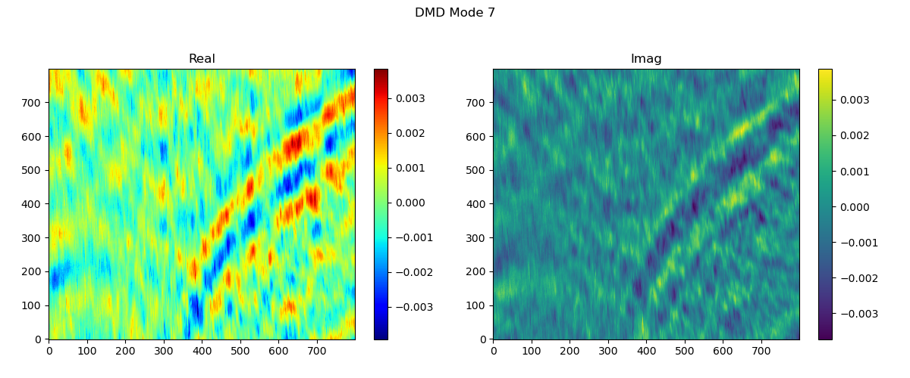
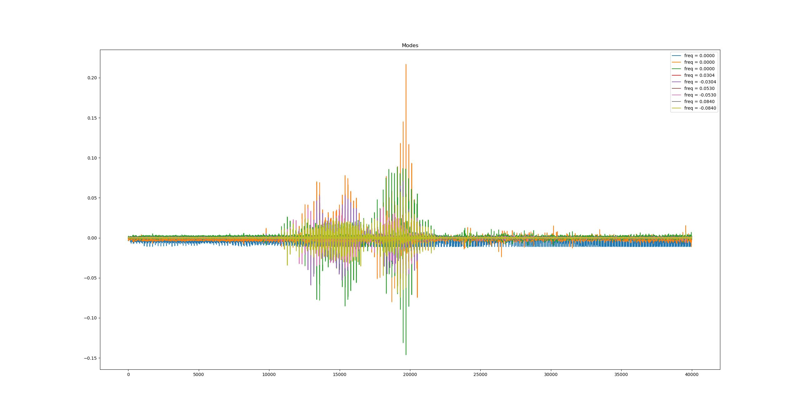
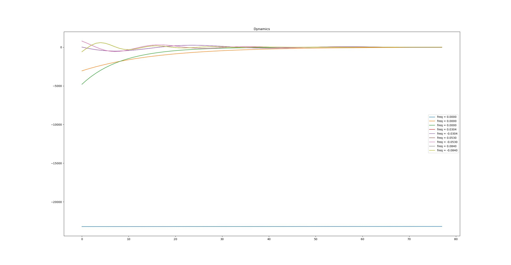
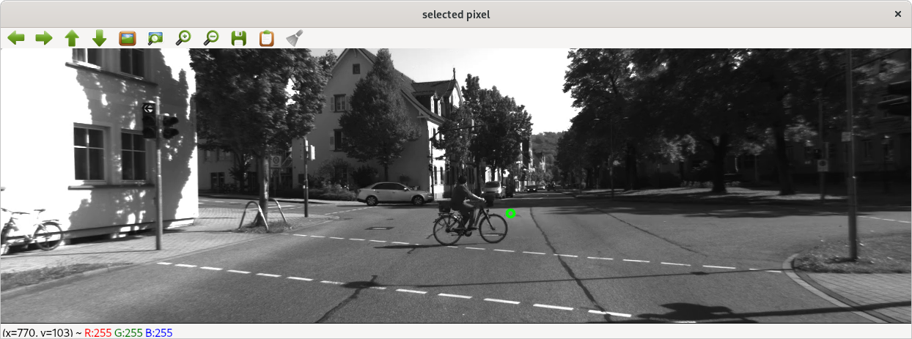
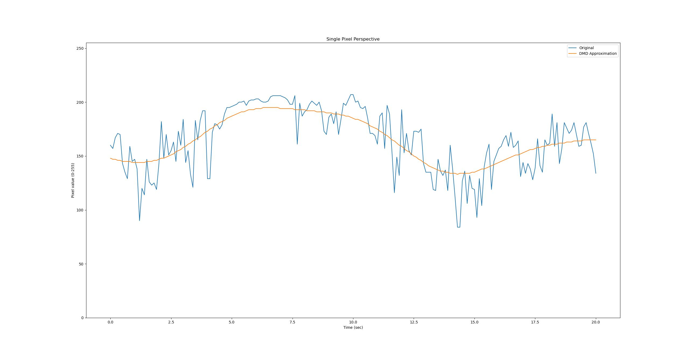
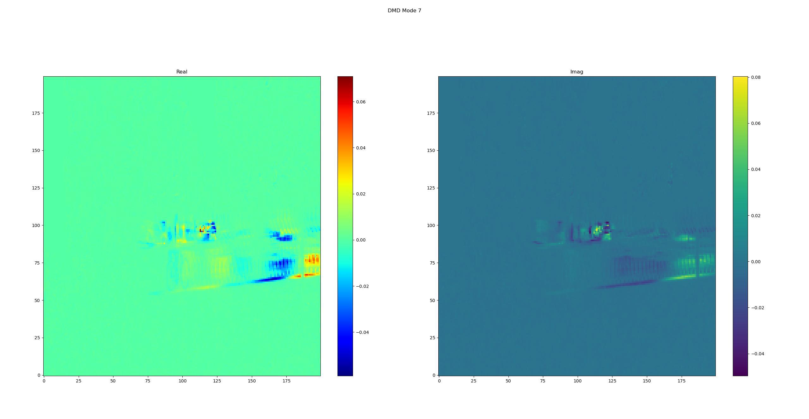
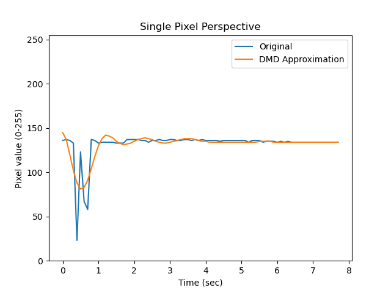
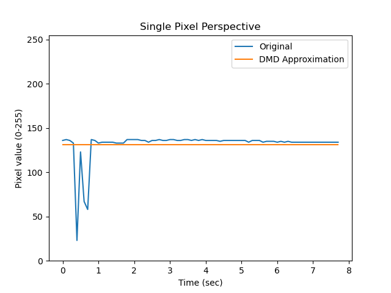

# Dynamic Mode Decomposition (DMD) Fundamentals

Here I describe some key aspects of DMD that I believe are importnat
to think about when considering DMD as a tool for motion-based scene
segmentation in video.

DMD computes an approximation (or simplification) of a set of input
sensor signals sampled over time. The approximation consists of a set
of shared oscillating basis functions and a weights for each sensor
corresponding to each basis function.  A lower order approximation of
the input data at any time *t* can be reconstructed from the set of
weightings (modes) and the basis functions (frequency, phase,
amplitude.)  DMD is sometimes thought of as a tool to perform mode
simplification in a system because it identifies and preserves the
most dominate oscillatory modes.

It can be useful to plot the weights of the basis functions to
understand the how the "energy" of the corresponding frequency is
structured in the system.  Here is an arbitrary example of a mode
plot:

DMD mode plot example

##

## DMD Constraint #1: Sampling Time Interval

It only makes sense to perform DMD on a set of data if all the sensors
have been sampled at a constant time interval.  This is mentioned in
the literature.

## DMD Constraint #2: Sensor/Sampling Locations

I have not found anywhere in the literature a stated requirement that
the sensors must maintain a fixed position within the system.  If
sensors can move through the system during the experiment they will be
sampling the system state at different locations.  In all the DMD
examples I have seen, there is an assumption the sensors have fixed
locations within the experiment or system.

DMD will produce a result if the first constraint is met, but of the
sensors are moving through the system, is that result meaningful or
interpretable?

# Terminology

## Definition: Modes

Consider a system that has "n" sensors which are sampled at "m" time
steps and we solve for "k" frequencies.  DMD will compute a set of "n"
weightings for each of the "k" basis functions (frequencies.)  The
frequencies can be evaluated along with phase/amplitude information at
each of the "m" time steps.

We can refer to a set of "n" weightings associated with a single
frequency as a **mode.** Notice in the following plot the "x" axis is
each pixel position The vertical axis is the mode weights.  In this
example the input data set is a 200 x 200 image ("n" = 40000 pixels)
and we solved for "k" = 9 basis functions.)

## Definition: Dynamics

We can evaluate the shared basis functions at each time step.  This is
called the **dynamics.**

The modes (the set of weightings) is fixed for the entire solution and
the dynamics changes with respect to time.  For the dynamics plot, the
horizontal axis is time and the vertical axis is amplitude.  Also note
that in the input video for this plot, there was motion at the
beginning, but very little motion at the end which corresponds to
diminishing dynamics over time.)

## Definition: Pixel Motion

Consider a video clip with an object moving through the frame.  Focus
on a single pixel as the video plays through.  It is important to
distinguish between how DMD sees the scene and how our eyes/brain see
the scene.

DMD is fitting something like a Fourier series to a time sequence of
data points from individual pixels.  As the bicycle rides across the
scene, the individual pixels are changing values at specific times to
create the illusion of motion.  Our brains see motion, but pixels are
not actually moving, and the values each pixel assumes over time don't
really convey velocity or direction information.

# Reconstructing the original sensor data

The DMD solution provides enough information to reconstruct an
approximation to the original video at any time step.

At a conceptual level each pixel has a unique set of basis function
weights and can be reconstructed individually, however in practice we
would use block (matrix) operations to reconstruct an entire frame of
video in one step.

To reconstruct an approximation at a specific time step, simply sum
the product of each mode (set of weights) multiplied by the respective
basis function evaluated at that time step.

The example below shows the original time series for a single pixel
compared to the approximation as computed by DMD.  As stated above,
the value of every pixel at every time step can be approximated.  Thus
it is possible to reconstruct (an approximation to) the entire input
video using only the modes and the basis functions.

Notice the reconstructed fit for each individual sensor with DMD will
not be as accurate as if a Fourier series was computed for each sensor
independently due to the shared frequencies in the DMD solution.

Also notice the many "impulse" style changes in the original signal.
These changes relate to the arbitrary motion of the camera and the
edges of arbitrary areas of the scene passing by each specific pixel.

A large number of modes (basis functions) are required to closely
approximate these sharp and unpredictable changes over the course of
the video sement.  This implies that there isn't specific frequency
information embedded in the signal beyond changing or not changing.
The Fourier series needs "all" the frequencies to approximate these
impulse changes.  Notice also that in this example of a moving camera,
the chosen pixel value is always changing.

# More About Modes

The modes (the set of sensor weightings for each basis function) can
directly provide insight into the motion of the system.  The modes can
expose the complex structures forming the dynamics of the system.
Another way to say this is that mode (weighting) shows how responsive
each sensor is to each frequency.

## Visualizing Modes

It can be useful to plot modes to see the energy (weights) at
different basis function frequencies.  Remember the mode is just the
set of weights for a specific basis function (frequency.)

Cherry picking an arbitrary mode from an arbitrary stationary video
with an object moving through as an example, the mode plot could look
like the following.  This plot shows some energy at some particular
frequency at some specific locations in the video frame. It shows zero
energy in all the background (not changing) positions. In this case
the X and Y axes are pixel locations in the original video.  This
allows us to "see" where energy at some frequency has occurred:

## Problem #1: Separating the amplitude of the input signals versus response at that frequency.

Remember that fundamentally DMD computes something like a Fourier
series approximation to the original data set.  We can use the output
of DMD to reconstruct the original pixel values at any time "t".
Consider that some pixels values will be small (dark regions) and some
pixel values will be large (light regions.)  To properly reconstruct
the original value, those dark pixels will have a low mode weighting,
while the bright pixels have a much higher relative weighting.  Thus,
each mode (set of weights) is a mixture of the original signal
amplitude and the response at a specific frequency.  There is no way
to directly separate if a low mode value (weighting) means a low
response at that frequency, or the original pixel was just a dark
pixel.

Imagine a black car driving on black asphalt as view from above.

## Problem #2: Impulse changes (step changes)

Consider the following "video" (just one frame is shown.)  An
arbitrary pixel is selected and shown in the green circle.  Full DMD
is performed for the entire 7.7 second video clip using a maximum rank
of 9 (9 basis functions for the Fourier series approximation.)

As the bike rides "through" the chosen pixel, here is the pixel value
over time.  Hopefully anyone that has seen demonstrations of using
Fourier series to approximate step functions or square waves in other
contexts can see the periodic nature of the Fourier approximation and
the need for a high number of terms to accurately approximate the
sharp changes in the original time series of the pixel.

Real world video (from the perspective of each individual pixel)
generally follows this behavior whenever there is motion.  It doesn't
matter if the motion is due to a foreground object moving, or the the
entire camera moving within the scene.  At the pixel level (looking at
the time history of a single pixel) the values change more like a
random unpredictable step function with no meaningful frequency
information (beyond steady vs. changing.)

**The important take away:** When there is visual motion in video
(either due to objects moving or the camera moving) the Fourier series
approximation generally shows energy at all the different non-zero
frequency modes, and also a need for a high number of terms to
accurately approximate the original time series step behavior.

This means that DMD can show the difference between moving or
non-moving regions of video, but in the general case, very little
useful information can be extracted from the non-zero frequency modes
beyond determining areas that have pixel values change versus areas
with constant pixel values (background.)

# The stationary camera solution

With DMD, the zero-frequency mode corresponds to the steady state
value of each pixel.  Conceptually this is **very** similar to the
average value of the pixel over the time spanned by the video clip.
It is technically not exactly the same as the average, but it is very
very close, and close enough that the end results could be though of
intuitively as equivalent.

Consider the plot of the same arbitrarily selected pixel in the
previous example (with the bike passing through it.)  Here is the plot
of the original pixel value versus the value of the DMD zero frequency
mode approximation.

Next is a plot of the zero frequency weightings (the zero frequency
mode.)  As you can see the bike has been [almost] entirely removed
from the scene.  This is the DMD magic for scene segmentation.  This
is the critical observation that allows DMD to be applied to visual
scene segmentation in video with a fixed camera.

The foreground (moving) portion of each frame could be reconstructed
by summing the non-zero frequency modes (sum of weights *
basis_function).  However it is generally easier (and faster) to
simply subtract the background from the current frame because the sum
of all the modes is the full approximation to the original scene.

# Conclusion

Hopefully this discussion sheds some light on specifically how DMD
works, what it does and what it doesn't do.  Hopefully I've show why
DMD does such a nice job for segmenting video scenes when the camera
is not moving.

But now imagine if the camera is moving in space...
