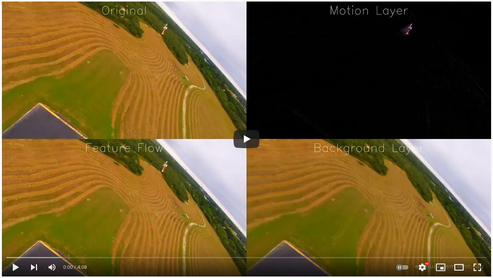

# Dynamic Mode Decomposition for Motion Segmentation in Video

**Dynamic Mode Decomposition:**

Dynamic Mode Decomposition (DMD) was first introduced by Peter Schmidt
(2008) to visualize dynamical features in flow data. [Source:
Wikipedia] It presumes data has been collected at a fixed time step
across a set of sensors.  DMD will compute an approximation to the
input data using a set of oscillating basis functions.  It is similar
to computing a Fourier series approximation to a set of signals, but
uses a shared set of basis functions for the entire set of sensors.
With DMD, the oscillating basis functions can grow or decay over time
and are not necessarily harmonics of each other.  The set of weights
for each basis function is called a mode.  The modes can be examined
directly to visualize dominant features of the system dynamics.

**Motion Segmentation:**

"Scene Segmentation" refers to visually identifying objects in a
scene, separating (or segmenting) the scene into it's important parts.
It is something humans do quickly and intuitively, but computers need
to work hard to accomplish and often aren't very reliable at this
task.

"Motion Segmentations" refers to segmenting a scene in a video clip by
observing how pixels change over time.

**Key Observation #1:**

The key underlying observation is that DMD can be applied to video
clips to do simple but effective motion segmentation.  One of the
modes that DMD produces is the "zero-frequency" mode.  This mode
corresponds to all the unchanging information in the scene.  The
zero-frequency DMD mode will be the scene background without any of
the moving elements (or with the moving elements minimized as much as
possible).

**Key Observation #2:**

With the DMD solution, a video frame can be reconstructed for any time
*t*, using the sum of the desired modes multipled by the respective
dynamic function evaltuated at time *t*.

The scene reconstructed with only the zero frequency DMD mode is
nearly identical to simply averaging the video frames together over
the same time period.  (It is not exactly the same in the mathematical
sense, but very close.)  Either approach (DMD or frame averaging)
produces a good approximation of the background without the moving
content.

**Past Work:**

Paper presented at AIAA SciTEch 2020 Forum: "Multi-Sensor Scene
Segmentation for Unmanned Air and Ground Vehicles using Dynamic Mode
Decomposition", Kalur, Bhattacharjee, Wang, Hemati, Bageshwar.

This paper explored the details of using DMD for scene segmentation of
video and LiDAR sensors that are fixed (not moving) in space.  It also
presented a "streaming" version of the DMD algorithm that can run
efficiently as video frames are collected.

**Current Research Question:**

Can the established DMD scene segmentation work be extended to a
moving camera?  A ground based surveillance camera may have a fixed
position and this use-case can be demonstrated to work well.  However
air and ground vehicles will move through their environments.

## Stationary Camera Example

The following demo video is captured from a stationary camera.  The
original scene is in the upper left.  The zero-mode frequency is top
center.  The next 7 most dominant modes fill the remaining grid
locations.

You can see that the zero-frequency mode hides most of the motion as
the video plays through.

The following false color plot of the zero frequency mode of this
video shows just how nice a job DMD does at separating out the
stationary background from the moving items.

## Running DMD on Video from a Moving Camera -- Intuition?

I think it is clear that simply applying DMD to video from a moving
camera will not produce a usable result in the same way that it does
for a fixed position camera ... all the pixels in video from a moving
camera are subject to constant change.  However, will DMD still
produce some result that could be analyzed to determine the common
motion of the background and separte that from motion of objects
within the scene?

If this were true, then there should be information in the DMD
solution that distinguishes the different types of motion.  Let's look
at the modes that DMD produces on a moving camera example.  Can we
"see" the background segmented by itself in any of the modes?  Could
there be some clever manipulation or combination of these modes that
would isolate the background by itself?

## Moving Camera Example

Consider the following example of a moving drone following a moving
vehicle.  The video begins with the drone stationary (similar to the
previous example), but after a few seconds the drone begins to move
forward and pan & tilt the camera to follow the vehicle motion.  The
DMD solution is updated each frame using a "sliding window" approach
that process the most recent 64 frames.  This allows the solution to
adapt over time.

As the drone begins to move, watch what happens to the modes.
**Question:** Does the zero-frequency mode (top center) show only the
background?  Answer: No, as before it still maintains a behavior
similar to producing an average of the input frames.  **Question:** Do
any of the other modes isolate background versus foreground motion?
Answer: No, all the pixel changes from any motion source (camera or
object) seem to show up in all the modes.  **Question:** Are pixel
changes in video oscillatory or more like step function changes?
Answer: Of course it depends a little on the specific video and
subject matter, but in the general case of drone video, there
typically isn't much oscillatory behavior to approximate.

Please watch the video for yourself:

Hopefully you can see that all the motion of the moving camera and the
moving vehicle gets blended together in all the modes.  There isn't
any clear visual separation between different types of motion.

Also notice how the road edges and background feature edges show up.
Think back to how a Fourier series needs many terms to begin to
closely approximate a step function.  Edges of areas in moving video
act like step functions as those features move over individual pixel
sensors.

Here is a false color plot of the zero frequency mode showing all the
motion (camera and vehicle) blended together.  As with stationary
camera video, the zero frequency mode multplied by the corresponding
basis fucntion is essentionally an average of the input frames:

If you are curious, here I've singled out an arbitrary pixel in the
video and show how it's value changes as the camera moves, versus the
DMD approximation to t his pixel over time.

**Take away**: By examinging the DMD modes for moving video, can we
see any evidence of motion segmentation? Answer: no, nothing pops out.
Thus DMD by itself doesn't provide meaningful scene segmentation
information with moving video.

# High Dynamics Moving Video Example

Consider a video with a very dynamic moving camera (chase quad) and a
dynamic subject (aerobatic aircraft.)  We have animated a sliding
window DMD solution so you can view it changing over time.
Functionally this would be similar to a Streaming DMD solution with
correctly implemented "forgetting" factor.

The original video is shown in the top left grid location.  The zero
frequency DMD mode is shown top center.  Visually it looks very much
like an average of the input frames as we would expect.

Looking at the other non-zero frequency modes, we can see the all the
elements described above.  None of the modes are able to isolate
camera motion from object motion in this general case.

In the case of a moving camera we can view all the different modes and
animate them throughout the course of the moving video, but we do not
see any modes that contain clear information with respect to
segmenting the moving parts of the scene from the static background.
The information we were hoping to extract just isn't there in the way
we hoped.  Hopefully the information and background provided
throughout this document kept this from being a surprise.

# Conclusion

The primary goal is to take video from a dynamically moving camera and
separate it into the steady background areas and moving foreground
areas.  Unfortunately DMD by itself is not able to separate out pixels
changes due to camera motion versus pixel changes due to object
motion.  DMD can distinguish pixels with nearly steady values versus
pixels with changing values in video, but beyond that does not produce
meaningful information.

With respect to scene segmentionation, DMD can provide a solution when
the camera is not moving, but is unable to provide meaningful pixel
change information when the camera is moving.

This does not necessarily mean the problem is unsolvable, but the
camera motion first needs to be estimated with some other strategy.
Once the motion is accounted for, perhaps DMD could be applied to the
result, or perhaps DMD is not the best fit for this problem?

# Future Work?

Consider the following video showing the use of optical flow and
homography to model camera motion which then enables the use of
variations of frame averaging and differencing.

