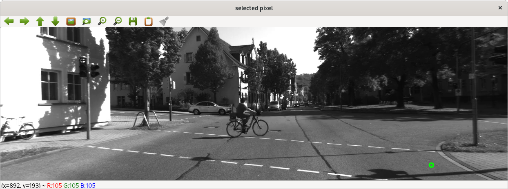
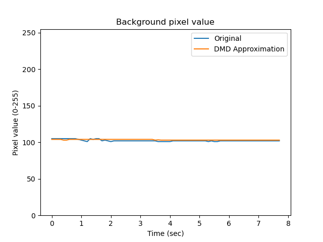
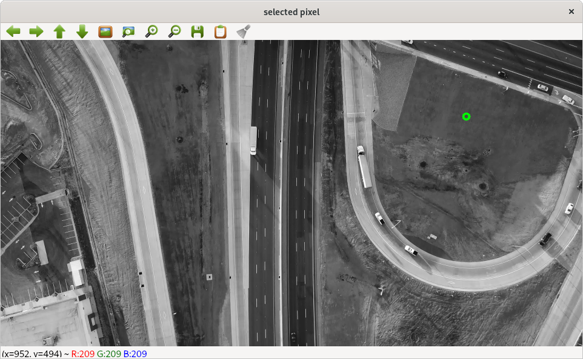

# A Few More Thoughts and Example Related to DMD and Moving Cameras

DMD = Dynamic Mode Decomposition

The main objective of this white paper is to think about DMD from the
perspective of an individual pixel to help clarify what DMD can and
can't do.

For this discussion I am thinking about video input (or an animated
sequence of images.)  Each pixel assumes a value in each frame and can
change independently over time.

## Pixel Adjacency (in space)

The order of the input vector elements does not affect the correct
output of the algorithm.  If the input is an image, the grid of pixels
can be stacked by columns, stacked by rows, or even assigned a
pseudo-random order, as long as this is done consistently for each
time step and the chosen arrangement is reversed before interpreting,
plotting, visualizing the results.

The DMD algorithm finds a set of matched modes and oscillating basis
functions that are simultaneous a best fit for the collection of
sensors.  Sensors are grouped in the sense of like behavior and
exhibit more or less energy at the common basis function frequencies.
They share behavior in the frequency domain but there is no adjacency
requirement in the original input data.

## Visual motion of groups of pixels (aka blobs)

Consider the apparent motion of a group of adjacent pixels.  Our
eyes/brain will do scene segmentation and motion tracking to interpret
the scene and humans are quite good at this task.  However, an
animated video is just a collection of frames where each frame is an
array of pixels.  Each pixel can take any value at any time step
independent of its neighbors.  Video motion is simply an animation of
individual frames of input being shown in quick succession.  Our
brains are "tricked" to see motion and objects, but the scene is
really just a collection of pixels changing value over time.

From the perspective of an individual pixel, its value changes over
time, but the pixel itself is unaware of larger structures in each
frame or the frame-to-frame motion of the video.

If we plot the value of an individual pixel from the video animation
in the time domain, the plot will more closely match a step function
(or a sequence of step functions) than any other type of function.

## DMD-based scene segmentation in video from a static camera

When the camera is not moving, pixels representing the static
background portion of a scene should not change (or change just a
little due to things like sensor noise or the camera adjusting its
exposure, etc.)

Applying DMD to a video sequence from a static camera produces a zero
frequency mode that correspondes to the non-changing pixels in the
video.  (Notice the DMD zero frequency mode maps directly to simply
averaging the frames of video together.)

Each frame can then be segmented into background (non-moving portion)
versus foreground (moving portion) by subtracting the background from
the current frame of video. Whatever pixels are different from the
background value are considered the non-zero frequency (moving)
segment of the frame.

This works well, and DMD is a success when the camera is not moving.
However, we generally cannot extract much useful information beyond
zero frequency vs. non-zero frequency.  Due to the step function
nature of individual pixel changes, the mode frequencies do not convey
useful information about the change or the speed or direction of the
larger strucuture movements in the video across the array of pixel.

Also observe that simply averaging frames is an O(n) operation for
each time step and also achieves the same result as computing the DMD
zero frequency mode.

## Example #1

Consider a static (fixed position) camera.  DMD is performed with a
max rank of 10.  (Motion is best approximated with 10 modes.)

**Background (zero frequency) pixel**

Consider the pixel highlighted in green below it is part of the static
background so it changes minimally through the movie animation.

Here is a plot of the pixel value over time:

**Moving/changing (non-zero frequency) pixel**

Consider the next pixel highlighted in green below it undergoes changing values as the bicycle rides across the scene.

Here is a plot of the pixel value over time (sum of all weights
multipled by their corresponding basis functions):

## DMD-based scene segmentation in video from a moving camera

Now consider that the camera is moving.  The static background will
appear to be moving in the video.  Our eyes/brain will do a good job
of interpreting this and understanding the scene.

However, DMD is mapping the values of each individual pixel to the
frequency domain, so we need to consider the camera motion from the
perspective of an individual pixel.  Again, similar to motion in a
static camera, motion of the background (for the perspective of an
individual pixel) acts more like a step function than any other
function.

Because the camera is moving and all the pixels are now subject to
change, the trick used in the fixed-camera use-case no longer works
and can't be directly extended in any useful way.  This is bad news,
but not the end of the story.

## Example #2

Consider a dynamic (moving position/orientation) camera.  DMD is
performed with a max rank of 10.  (Motion is best approximated with 10
modes.)

Consider the pixel highlighted in green below.  As the scene scrolls
(from top to bottom) the pixel will pass over a road with dark
pavement and white lines.  Notice that as is passes over areas of
relatively constant shading, the pixel value will not change much, but
as objects pass through the pixel, the value will have sharp changes.
These changes are typically not periodic.  Like in the static camera
case, DMD will tell us when pixel is static versus when it changes,
however unlike the static case, with a dynamically moving camera, we
must assume constant and unpredictable pixel value changes.

Here is a plot of the pixel value over time.  You may be able to see
that a Fourier serious would need a large number of terms to
accurately fit the input data sequence and that generally means there
isn't any clear oscillatory behavior in the input data for DMD to fit
with a smaller set of modes:

